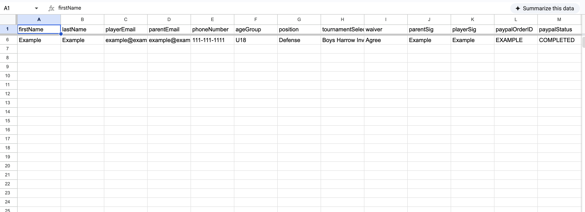

# East Coast Dragons

A modern React-based web application built for the East Coast Dragons organization. This project features a responsive layout, a persistent user contact form using React hooks paired with Netlify forms and Google Apps backend, and dynamic smooth scrolling.

##  Features

Responsive Contact Form: Fully integrated with Netlify forms for serverless submission tracking.

State Persistence: Leverages local storage via custom React hooks (useStorageState) to preserve user input across page refreshes.

Smooth Navigation: Custom viewport offset scrolling to account for fixed header positioning.

Google Script API: Automaically stores contact submission and sends confirmation email

Clean UI: Modern, accessible styling using flexbox/grid structures and CSS variables.

##  Built With

Frontend: React (JavaScript, JSX, CSS3)

Hosting & Backend Forms: Netlify, Google Scripts

Version Control: Git & GitHub

## Google Sheets & Apps Script Integration

This project uses a Google Apps Script background service to handle custom tournament roster routing and data logging directly from the web frontend.

###  System Overview
* **Database/CRM:** Google Sheets
* **Backend API Engine:** Google Apps Script Web App
* **Live Code:** You can view the complete architecture script in the [google-scripts/ folder](./google-scripts/).

###  Database Architecture (Google Sheets)
Below is a look at how the incoming automated payload organizes tournament sign-ups in real-time:

###  How It Works
1. The Netlify serverless function processes a successful PayPal checkout event.
2. A payload containing tournament selection and player details is sent via `POST` to the `GOOGLE_SCRIPT_URL`.
3. The Apps Script dynamically parses the incoming JSON, checks for existing entries, appends a new row to the matching tournament sheet tab, and fires a confirmation response.

##  Getting Started

Follow these instructions to get a copy of the project up and running on your local machine for development and testing purposes.

Prerequisites
Make sure you have Node.js and npm installed and the right .env file. You can check by running:

Bash
node -v
npm -v

Installation
Clone the repository:

Bash
git clone https://github.com/aduan48/East-Coast-Dragons.git
Navigate into the project directory:

Bash
cd East-Coast-Dragons
Install the dependencies:

Bash
npm install
Running Locally
To launch the local development server:

Bash
netlify dev

## Deployment

This project is automatically built and deployed via Netlify when changes are pushed to the main branch.

Netlify Forms Configuration
The contact form relies on a shadow HTML form located in public/index.html to allow Netlify’s build bots to register the submission endpoint without relying on an external server API.

## License

This project is licensed under the MIT License - see the LICENSE file for details.